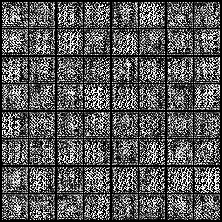
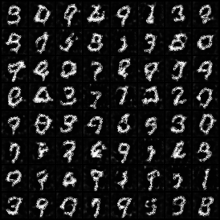
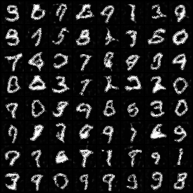

# GAN
Minimal DCGAN like implementation using `pytorch` and `pytorch-lightning`.

Generator output on fixed latent vector after 0/10/20 epochs:  
  


## Usage:
```sh
poetry install # or pip install . --user
python dcgan.py --max_epochs 20 # optionally with --gpus 1 if available
tensorboard --logdir lightning_logs # to monitor training
```
